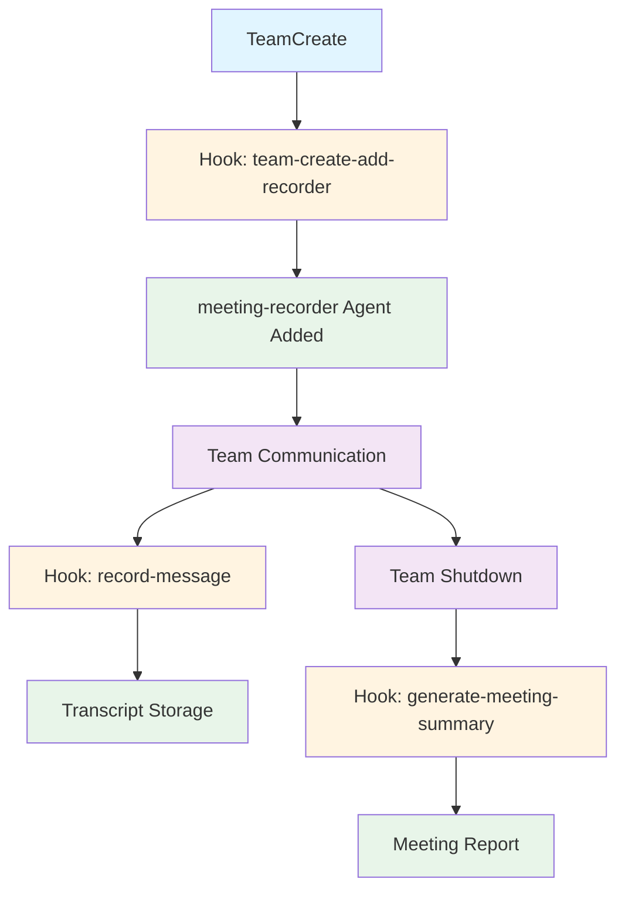

# Meeting Management Plugin

Claude Code Agent Team 간의 회의를 자동으로 기록하고 관리하는 플러그인입니다.

## Overview

이 플러그인은 Claude Code Agent Team이 진행하는 모든 회의를 자동으로 녹취하고, 정리된 문서를 생성합니다.

### 주요 기능

- **자동 참여**: 모든 Agent Team 생성 시 meeting-recorder agent 자동 추가
- **실시간 녹취**: 모든 팀 커뮤니케이션 실시간 기록
- **요약 생성**: 회의 내용 자동 요약
- **Action Item 추출**: 논의된 작업 항목과 담당자 자동 식별
- **참여자 추적**: 각 참여자의 기여도 모니터링

## Architecture



## Project Structure

```
meeting-management/
├── .claude/
│   ├── agents/
│   │   └── meeting-recorder.md       # 회의 기록 Agent 정의
│   ├── skills/
│   │   └── meeting-record.md         # 회의 관리 Skill 정의
│   ├── rules/
│   │   └── meeting-auto-recorder.md  # 자동 참여 Rule
│   ├── hooks/
│   │   ├── team-create-add-recorder.py     # 팀 생성 Hook
│   │   ├── record-message.py               # 메시지 녹취 Hook
│   │   ├── generate-meeting-summary.py     # 요약 생성 Hook
│   │   ├── test_hooks.py                   # Hook 테스트 스크립트
│   │   ├── hooks.json                      # Hook 설정 파일
│   │   └── README.md                       # Hook 문서
│   ├── settings.json                    # 프로젝트 Hook 설정
│   └── docs/
│       └── meeting-records/           # 회의 기록 저장소
│           ├── 2026-03-15-001-api-design.md      # 녹취록
│           ├── 2026-03-15-001-api-design-summary.md  # 요약
│           ├── 2026-03-15-002-database.md
│           ├── 2026-03-15-002-database-summary.md
│           └── .sequence                          # 일련 번호 추적
├── setup.py                             # 설치 스크립트
└── README.md                           # 이 파일
```

## Components

### 1. meeting-recorder Agent

**파일**: `.claude/agents/meeting-recorder.md`

모든 회의에 참여하여 기록을 담당하는 전담 Agent입니다.

- 모든 팀 커뮤니케이션 모니터링
- 실시간 녹취록 생성
- Action Item 추출
- 참여자 기여도 추적

### 2. meeting-record Skill

**파일**: `.claude/skills/meeting-record.md`

회의 관리를 위한 슬래시 명령어 세트입니다.

| 명령어 | 설명 |
|--------|------|
| `/meeting-start` | 새 회의 녹취 시작 |
| `/meeting-end` | 회의 종료 및 보고서 생성 |
| `/meeting-list` | 모든 회의 기록 목록 |
| `/meeting-search <query>` | 회의 내용 검색 |
| `/meeting-summary <id>` | 특정 회의 요약 조회 |
| `/meeting-actions <id>` | Action Item 추출 |

### 3. meeting-auto-recorder Rule

**파일**: `.claude/rules/meeting-auto-recorder.md`

모든 Agent Team에 meeting-recorder를 자동 추가하는 Rule입니다.

- TeamCreate 시 자동으로 meeting-recorder 추가
- acceptEdits 모드로 기록 권한 부여
- 팀 생성 즉시 녹취 시작

### 4. Hook Scripts

| Hook 파일 | 트리거 | 기능 |
|-----------|--------|------|
| `team-create-add-recorder.py` | SubagentStart | 팀 생성 시 recorder 자동 추가 |
| `record-message.py` | Notification | 모든 메시지 녹취 |
| `generate-meeting-summary.py` | SubagentStop | 회의 종료 시 요약 생성 |

## Installation

### 빠른 시작 (권장)

이 플러그인은 미리 구성된 `.claude/settings.json` 파일을 포함합니다. 다음 단계로 설치하세요:

1. 이 저장소를 프로젝트에 클론합니다
2. Claude Code에서 프로젝트를 엽니다
3. `.claude/settings.json`에서 hooks가 자동으로 로드됩니다

```bash
# 플러그인 클론
git clone https://github.com/yarang/meeting-management.git
cd meeting-management

# 프로젝트로 복사 (선택사항)
cp -r .claude /path/to/your/project/
```

### 수동 설정

수동으로 구성하려면 프로젝트의 `.claude/settings.json`에 다음을 추가하세요:

**파일**: `<your-project>/.claude/settings.json`

```json
{
  "hooks": {
    "SubagentStart": [
      {
        "hooks": [
          {
            "type": "command",
            "command": "python3 .claude/hooks/team-create-add-recorder.py",
            "timeout": 10
          }
        ]
      }
    ],
    "Notification": [
      {
        "hooks": [
          {
            "type": "command",
            "command": "python3 .claude/hooks/record-message.py",
            "timeout": 10
          }
        ]
      }
    ],
    "SubagentStop": [
      {
        "hooks": [
          {
            "type": "command",
            "command": "python3 .claude/hooks/generate-meeting-summary.py",
            "timeout": 10
          }
        ]
      }
    ]
  }
}
```

### 전역 설치 (선택사항)

모든 프로젝트에서 이 플러그인을 사용하려면 다음을 실행하세요:

```bash
python setup.py install
```

전역 `~/.claude/settings.json`에 hooks가 추가됩니다.

## Usage

### 자동 사용 (권장)

```bash
# 팀 생성 - meeting-recorder 자동 추가
TeamCreate team_name="my-project"
```

### 수동 명령어

```bash
# 회의 시작
/meeting-start

# 회의 종료
/meeting-end

# 회의 목록
/meeting-list

# 회의 검색
/meeting-search "API design"

# 요약 조회
/meeting-summary 2026-03-14

# Action Items
/meeting-actions 2026-03-14
```

## Meeting Record Format

### File Naming Convention

회의록은 `.claude/docs/meeting-records/` 디렉토리에 다음 규칙으로 저장됩니다:

- **녹취록**: `YYYY-MM-DD-NNN-topic.md` (예: `2026-03-15-001-api-design.md`)
- **요약**: `YYYY-MM-DD-NNN-topic-summary.md` (예: `2026-03-15-001-api-design-summary.md`)
- **NNN**: 일련 번호 (001, 002, 003, ...)
- **topic**: 자동 추출된 주제 (api-design, database, auth, planning 등)

### Topic 자동 추출

회의 내용에서 다음 키워드를 감지하여 topic을 자동 생성합니다:

| Topic | 키워드 |
|-------|--------|
| `api-design` | api, endpoint, rest, graphql, interface |
| `database` | database, schema, migration, query, sql |
| `auth` | auth, login, permission, security, token |
| `frontend` | ui, frontend, component, react, vue |
| `backend` | backend, server, service, microservice |
| `testing` | test, testing, coverage, pytest, unit |
| `deployment` | deploy, release, ci/cd, build, docker |
| `planning` | plan, sprint, backlog, estimate, task |
| `bug` | bug, fix, issue, error, problem |
| `review` | review, pr, code review, pull request |
| `general` | (기본값, 위 키워드 없음) |

### Transcript Format

```markdown
# Meeting Transcript

**Meeting ID:** 2026-03-15-001
**Team:** my-project
**Topic:** api-design
**Date:** 2026-03-15
**Started:** 2026-03-15 10:00:00

---

### [10:00:15] agent1 → team-lead

Let's start discussing the API design...

### [10:01:30] agent2 → team-lead

I think we should use RESTful architecture...
```

### Summary Format

```markdown
# Meeting Summary

**Meeting ID:** 2026-03-15-001-api-design
**Team:** my-project
**Topic:** api-design
**Date:** 2026-03-15
**Participants:** 2 (agent1, agent2)
**Messages:** 15
**Action Items:** 2

---

## Discussion Summary

### Opening
Meeting initiated by agent1

### Discussion
agent1: Let's design the API endpoints...
agent2: We should use RESTful architecture...

### Closing
Meeting concluded by team-lead

## Action Items

### 1. Design the API endpoints...
- **Assignee:** agent1
- **Source:** team-lead
- **Time:** 10:05:00

### 2. Create database schema...
- **Assignee:** agent2
- **Source:** team-lead
- **Time:** 10:10:00

## Next Steps

1. Review and prioritize action items
2. Assign deadlines to 2 action items
3. Schedule follow-up meeting if needed
4. Update project tracking system

---

**Generated:** 2026-03-15 11:00:00
**Transcript:** .claude/docs/meeting-records/2026-03-15-001-api-design.md
```

## Testing

Hook 기능 테스트:

```bash
cd .claude/hooks
python test_hooks.py
```

예상 결과:
```
✓ Team creation hook: PASSED
✓ Message recording hook: PASSED
✓ Summary generation hook: PASSED
```

## Development

### Agent 추가/수정

`.claude/agents/meeting-recorder.md`를 수정하여 기능을 확장합니다.

### Hook 추가/수정

`.claude/hooks/` 디렉토리에서 새로운 Hook 스크립트를 작성하고 `hooks.json`에 등록합니다.

### Rule 추가/수정

`.claude/rules/` 디렉토리에서 새로운 Rule을 작성합니다.

## Documentation

- **English**: [README.md](README.md)
- **한국어**: [README.ko.md](README.ko.md)

## License

MIT License

## Author

Claude Code Meeting Management Plugin

---

**Version**: 1.0.0
**Last Updated**: 2026-03-15
