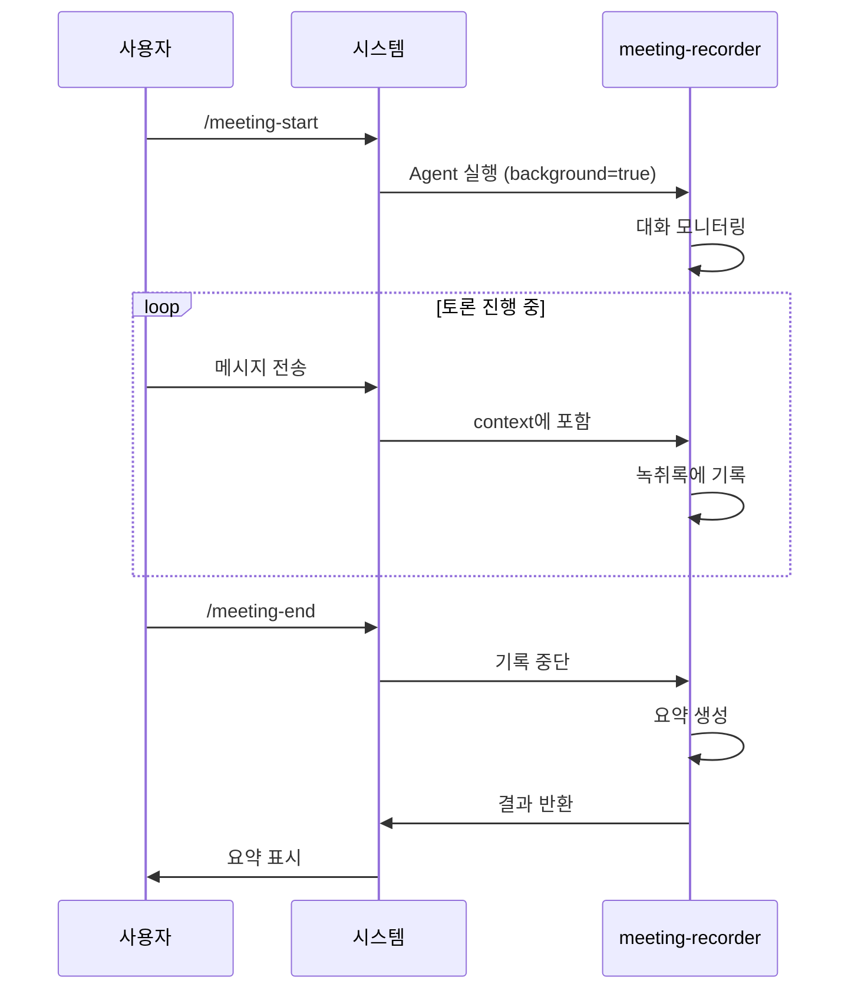

# Meeting Management Plugin

Claude Code Agent Team 간의 회의를 자동으로 기록하고 관리하는 플러그인입니다.

## Overview

이 플러그인은 Claude Code Agent Team이 진행하는 모든 회의를 자동으로 녹취하고, 정리된 문서를 생성합니다.

### 주요 기능

- **명령어 제어**: `/meeting-start`, `/meeting-end`로 간단한 제어
- **Agent 기반**: meeting-recorder agent가 지능형 녹취 수행
- **자동 요약**: 회의 요약과 Action Item 추출
- **주제 감지**: 대화 내용에서 주제 자동 감지
- **구조화된 출력**: 체계적인 markdown 녹취록과 요약

## Architecture

```mermaid
graph LR
    A[/meeting-start] --> B[meeting-recorder Agent]
    B --> C[Monitor Messages]
    C --> D[Transcript Logging]
    E[/meeting-end] --> F[Generate Summary]

    style A fill:#e1f5ff
    style B fill:#e8f5e9
    style C fill:#f3e5f5
    style D fill:#e8f5e9
    style E fill:#fff4e1
    style F fill:#e8f5e9
```

## Project Structure

```
meeting-management/
├── .claude/
│   ├── agents/
│   │   └── meeting-recorder.md       # 회의 기록 Agent
│   ├── skills/
│   │   └── meeting-record.md         # 회의 기록 명령어
│   ├── docs/
│   │   └── meeting-records/           # 회의 기록 저장소
│   │       ├── 2026-03-15-001-api-design.md      # 녹취록
│   │       ├── 2026-03-15-001-api-design-summary.md  # 요약
│   │       └── .sequence                          # 일련 번호 추적
│   └── settings.json                    # 프로젝트 설정 (비어있음)
├── tests/
│   └── test_integration.py
└── README.md
```

## Quick Start

### 1. 설치

프로젝트에 파일들을 복사하세요:

```bash
# 플러그인 클론
git clone https://github.com/yarang/meeting-management.git
cd meeting-management

# 프로젝트로 복사
cp -r .claude /path/to/your/project/
```

### 2. Agent Teams 활성화

`~/.claude/settings.json`에서 Agent Teams가 활성화되어 있는지 확인하세요:

```json
{
  "env": {
    "CLAUDE_CODE_EXPERIMENTAL_AGENT_TEAMS": "1"
  }
}
```

### 3. 명령어 사용

```bash
# 회의 기록 시작
/meeting-start

# ... 토론 진행 ...

# 기록 종료 및 요약 생성
/meeting-end

# 모든 회의 목록
/meeting-list
```

## 명령어

### `/meeting-start`

현재 회의 기록을 시작합니다.

**동작:**
- 백그라운드 모드로 meeting-recorder agent 실행
- Agent가 대화의 모든 메시지 모니터링
- 자동 주제 감지로 녹취록 파일 생성

**출력:**
```
✅ 회의 기록 시작
📝 회의 ID: 2026-03-15-001
🎯 주제: [대화 내용에서 자동 감지]
```

### `/meeting-end`

현재 회의를 종료하고 요약을 생성합니다.

**동작:**
- 메시지 기록 중단
- 회의 요약 및 Action Item 생성
- 참여자 및 핵심 논의 사항 추출

**출력:**
```
✅ 회의 기록 종료
📊 경과 시간: 45분
👥 참여자: 3명
💬 메시지: 28개
✅ Action Items: 5개

📄 요약: .claude/docs/meeting-records/2026-03-15-001-api-design-summary.md
```

### `/meeting-list`

모든 회의 기록 목록을 표시합니다.

**표시 항목:**
- 회의 ID, 날짜, 주제
- 참여자 수
- 메시지 수

### `/meeting-status`

현재 기록 상태를 표시합니다.

**표시 항목:**
- 기록 중인지 여부
- 기록 중이면 현재 회의 ID

## 회의 기록 형식

### 파일명 규칙

- **녹취록**: `YYYY-MM-DD-NNN-topic.md`
- **요약**: `YYYY-MM-DD-NNN-topic-summary.md`
- **NNN**: 일련 번호 (001, 002, 003, ...)
- **topic**: 대화 내용에서 자동 감지

### 주제 자동 감지

| 주제 | 키워드 |
|-------|--------|
| api-design | api, endpoint, rest, graphql |
| database | database, schema, migration, query |
| auth | auth, login, permission, security |
| frontend | ui, frontend, component, react |
| backend | backend, server, service |
| testing | test, testing, coverage, pytest |
| deployment | deploy, release, ci/cd, docker |
| planning | plan, sprint, backlog, estimate |
| bug | bug, fix, issue, error |
| review | review, pr, code review |
| general | (기본값) |

## 작동 방식

### 기록 프로세스



### 기술적 세부사항

1. **Agent 실행**: `Agent` 도구에 `background=true`, `mode="acceptEdits"` 사용
2. **메시지 접근**: Read 도구로 대화 context 읽기
3. **녹취록 형식**: YAML frontmatter와 구조화된 markdown
4. **요약 생성**: AI 기반 대화 분석

## 요구사항

- Agent Teams 지원 Claude Code
- `CLAUDE_CODE_EXPERIMENTAL_AGENT_TEAMS=1` 활성화
- `.claude/docs/meeting-records/` 쓰기 권한

## 문제 해결

### 회의가 기록되지 않나요?

1. Agent Teams 활성화 확인: `CLAUDE_CODE_EXPERIMENTAL_AGENT_TEAMS=1`
2. meeting-recorder agent 존재 확인: `.claude/agents/meeting-recorder.md`
3. skill 로딩 확인: `.claude/skills/meeting-record.md`
4. `/meeting-status`로 현재 상태 확인

### Action Items가 감지되지 않나요?

- 키워드로 감지: "todo", "task", "assign", "will do" 등
- 담당자를 명시하면 더 잘 감지됩니다

### 주제가 틀렸나요?

- 주제는 초기 몇 메시지에서 자동 감지됩니다
- 기록 후 파일 이름을 수동으로 변경할 수 있습니다

## Documentation

- **English**: [README.md](README.md)
- **한국어**: [README.ko.md](README.ko.md)

## License

MIT License

## Author

Claude Code Meeting Management Plugin

---

**Version**: 2.0.0
**Last Updated**: 2026-03-15
