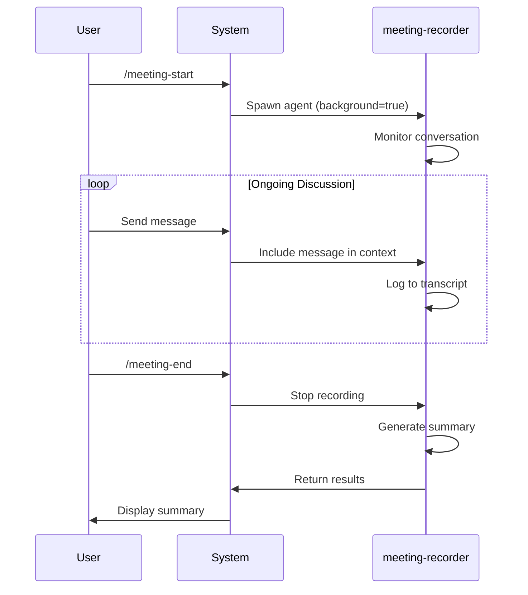

# Meeting Management Plugin

A plugin for automatically recording and managing meetings between Claude Code Agent Teams.

## Overview

This plugin automatically records all meetings conducted by Claude Code Agent Teams and generates organized documentation.

### Key Features

- **Command-Based Control**: Simple slash commands to start/stop recording
- **Agent-Powered**: Uses meeting-recorder agent for intelligent transcription
- **Auto-Summary**: Generates meeting summaries with action items
- **Topic Detection**: Automatically detects meeting topic from conversation
- **Structured Output**: Organized markdown transcripts and summaries

## Architecture

```mermaid
graph LR
    A[/meeting-start] --> B[meeting-recorder Agent]
    B --> C[Monitor Messages]
    C --> D[Transcript Logging]
    E[/meeting-end] --> F[Generate Summary]

    style A fill:#e1f5ff
    style B fill:#e8f5e9
    style C fill:#f3e5f5
    style D fill:#e8f5e9
    style E fill:#fff4e1
    style F fill:#e8f5e9
```

## Project Structure

```
meeting-management/
├── .claude/
│   ├── agents/
│   │   └── meeting-recorder.md       # Meeting recorder agent
│   ├── skills/
│   │   └── meeting-record.md         # Meeting record commands
│   ├── docs/
│   │   └── meeting-records/           # Meeting records storage
│   │       ├── 2026-03-15-001-api-design.md      # Transcript
│   │       ├── 2026-03-15-001-api-design-summary.md  # Summary
│   │       └── .sequence                          # Sequence tracker
│   └── settings.json                    # Project settings (empty)
├── tests/
│   └── test_integration.py
├── setup.py                             # Installation script
└── README.md
```

## Quick Start

### 1. Installation

Copy these files to your project:

```bash
# Clone the plugin
git clone https://github.com/yarang/meeting-management.git
cd meeting-management

# Copy to your project
cp -r .claude /path/to/your/project/
```

### 2. Enable Agent Teams

Ensure Agent Teams is enabled in your `~/.claude/settings.json`:

```json
{
  "env": {
    "CLAUDE_CODE_EXPERIMENTAL_AGENT_TEAMS": "1"
  }
}
```

### 3. Use Commands

```bash
# Start meeting recording
/meeting-start

# ... have your discussion ...

# End recording and generate summary
/meeting-end

# List all meetings
/meeting-list
```

## Commands

### `/meeting-start`

Start recording the current meeting.

**What it does:**
- Spawns meeting-recorder agent in background mode
- Agent monitors all messages in the conversation
- Creates transcript file with automatic topic detection

**Output:**
```
✅ Meeting recording started
📝 Meeting ID: 2026-03-15-001
🎯 Topic: [auto-detected from conversation]
```

### `/meeting-end`

End the current meeting and generate summary.

**What it does:**
- Stops message recording
- Generates meeting summary with action items
- Extracts participants and key discussion points

**Output:**
```
✅ Meeting recording ended
📊 Duration: 45 minutes
👥 Participants: 3
💬 Messages: 28
✅ Action Items: 5

📄 Summary: .claude/docs/meeting-records/2026-03-15-001-api-design-summary.md
```

### `/meeting-list`

List all meeting records.

**Shows:**
- Meeting ID, date, topic
- Participant count
- Message count

### `/meeting-status`

Show current recording status.

**Shows:**
- Whether recording is active
- Current meeting ID if recording

## Meeting Record Format

### File Naming Convention

- **Transcript**: `YYYY-MM-DD-NNN-topic.md`
- **Summary**: `YYYY-MM-DD-NNN-topic-summary.md`
- **NNN**: Sequence number (001, 002, 003, ...)
- **topic**: Auto-detected from conversation

### Topic Auto-Detection

| Topic | Keywords |
|-------|----------|
| api-design | api, endpoint, rest, graphql |
| database | database, schema, migration, query |
| auth | auth, login, permission, security |
| frontend | ui, frontend, component, react |
| backend | backend, server, service |
| testing | test, testing, coverage, pytest |
| deployment | deploy, release, ci/cd, docker |
| planning | plan, sprint, backlog, estimate |
| bug | bug, fix, issue, error |
| review | review, pr, code review |
| general | (default) |

## How It Works

### Recording Process



### Technical Details

1. **Agent Spawning**: Uses `Agent` tool with `background=true` and `mode="acceptEdits"`
2. **Message Access**: Agent reads conversation context via Read tool
3. **Transcript Format**: Structured markdown with YAML frontmatter
4. **Summary Generation**: AI-powered analysis of conversation

## Requirements

- Claude Code with Agent Teams support
- `CLAUDE_CODE_EXPERIMENTAL_AGENT_TEAMS=1` enabled
- Write permissions for `.claude/docs/meeting-records/`

## Troubleshooting

### Meeting not recording?

1. Check if Agent Teams is enabled: `CLAUDE_CODE_EXPERIMENTAL_AGENT_TEAMS=1`
2. Verify meeting-recorder agent exists: `.claude/agents/meeting-recorder.md`
3. Check skill is loaded: `.claude/skills/meeting-record.md`
4. Try `/meeting-status` to see current state

### Action items not detected?

- Action items are detected from keywords: "todo", "task", "assign", "will do", etc.
- Make sure to explicitly mention assignees for better detection

### Topic wrong?

- Topic is auto-detected from first few messages
- You can manually rename the transcript file after recording

## Documentation

- **English**: [README.md](README.md)
- **한국어**: [README.ko.md](README.ko.md)

## License

MIT License

## Author

Claude Code Meeting Management Plugin

---

**Version**: 2.0.0
**Last Updated**: 2026-03-15
