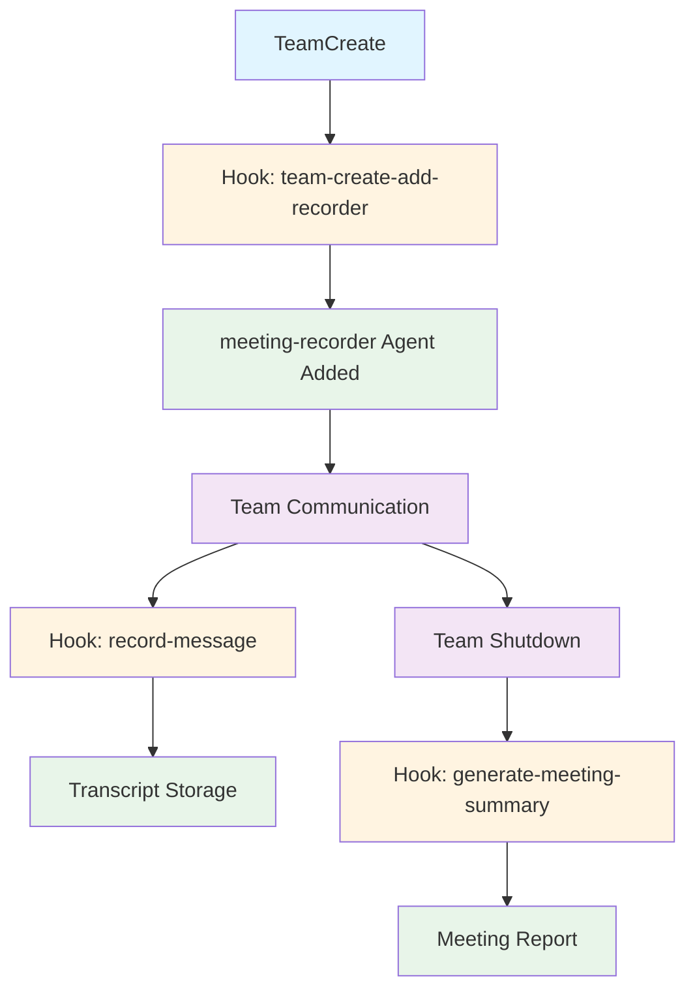

# Meeting Management Plugin

A plugin for automatically recording and managing meetings between Claude Code Agent Teams.

## Overview

This plugin automatically records all meetings conducted by Claude Code Agent Teams and generates organized documentation.

### Key Features

- **Auto-Join**: Automatically adds meeting-recorder agent to all Agent Teams
- **Real-time Transcription**: Records all team communications in real-time
- **Summary Generation**: Automatically generates meeting summaries
- **Action Item Extraction**: Identifies discussed tasks and assignees
- **Participant Tracking**: Monitors each participant's contributions

## Architecture



## Project Structure

```
meeting-management/
├── .claude/
│   ├── agents/
│   │   └── meeting-recorder.md       # Meeting recorder agent definition
│   ├── skills/
│   │   └── meeting-record.md         # Meeting record skill definition
│   ├── rules/
│   │   └── meeting-auto-recorder.md  # Auto-join rule
│   ├── hooks/
│   │   ├── team-create-add-recorder.py     # Team creation hook
│   │   ├── record-message.py               # Message recording hook
│   │   ├── generate-meeting-summary.py     # Summary generation hook
│   │   ├── test_hooks.py                   # Hook test script
│   │   ├── hooks.json                      # Hook configuration file
│   │   └── README.md                       # Hook documentation
│   ├── settings.json                    # Project hook settings
│   └── docs/
│       └── meeting-records/           # Meeting records storage
│           ├── 2026-03-15-001-api-design.md      # Transcript
│           ├── 2026-03-15-001-api-design-summary.md  # Summary
│           ├── 2026-03-15-002-database.md
│           ├── 2026-03-15-002-database-summary.md
│           └── .sequence                          # Sequence number tracker
├── setup.py                             # Installation script
└── README.md                           # This file
```

## Components

### 1. meeting-recorder Agent

**File**: `.claude/agents/meeting-recorder.md`

Dedicated agent responsible for recording all meetings.

- Monitors all team communications
- Generates real-time transcripts
- Extracts action items
- Tracks participant contributions

### 2. meeting-record Skill

**File**: `.claude/skills/meeting-record.md`

Set of slash commands for meeting management.

| Command | Description |
|---------|-------------|
| `/meeting-start` | Start recording a new meeting |
| `/meeting-end` | End meeting and generate report |
| `/meeting-list` | List all meeting records |
| `/meeting-search <query>` | Search meeting content |
| `/meeting-summary <id>` | Get summary of specific meeting |
| `/meeting-actions <id>` | Extract action items |

### 3. meeting-auto-recorder Rule

**File**: `.claude/rules/meeting-auto-recorder.md`

Rule that automatically adds meeting-recorder to all Agent Teams.

- Automatically adds meeting-recorder on TeamCreate
- Grants recording permissions in acceptEdits mode
- Starts recording immediately upon team creation

### 4. Hook Scripts

| Hook File | Trigger | Function |
|-----------|---------|----------|
| `team-create-add-recorder.py` | SubagentStart | Auto-add recorder on team creation |
| `record-message.py` | Notification | Record all messages |
| `generate-meeting-summary.py` | SubagentStop | Generate summary on meeting end |

## Installation

### Quick Start (Recommended)

This plugin includes a pre-configured `.claude/settings.json` file. Simply:

1. Clone this repository to your project
2. Open the project in Claude Code
3. The hooks are automatically loaded from `.claude/settings.json`

```bash
# Clone the plugin
git clone https://github.com/yarang/meeting-management.git
cd meeting-management

# Copy to your project (optional)
cp -r .claude /path/to/your/project/
```

### Manual Configuration

If you prefer manual configuration, add the following to your project's `.claude/settings.json`:

**File**: `<your-project>/.claude/settings.json`

```json
{
  "hooks": {
    "SubagentStart": [
      {
        "hooks": [
          {
            "type": "command",
            "command": "python3 .claude/hooks/team-create-add-recorder.py",
            "timeout": 10
          }
        ]
      }
    ],
    "Notification": [
      {
        "hooks": [
          {
            "type": "command",
            "command": "python3 .claude/hooks/record-message.py",
            "timeout": 10
          }
        ]
      }
    ],
    "SubagentStop": [
      {
        "hooks": [
          {
            "type": "command",
            "command": "python3 .claude/hooks/generate-meeting-summary.py",
            "timeout": 10
          }
        ]
      }
    ]
  }
}
```

### Global Installation (Optional)

If you want to use this plugin across all projects, run:

```bash
python setup.py install
```

This adds hooks to your global `~/.claude/settings.json`.

### After Installation

The hooks will be automatically loaded when you open the project in Claude Code. The meeting-recorder will be automatically added to all new Agent Teams created in this project.

## Usage

### Automatic Usage (Recommended)

```bash
# Create team - meeting-recorder automatically added
TeamCreate team_name="my-project"
```

### Manual Commands

```bash
# Start meeting
/meeting-start

# End meeting
/meeting-end

# List meetings
/meeting-list

# Search meetings
/meeting-search "API design"

# Get summary
/meeting-summary 2026-03-14

# Get action items
/meeting-actions 2026-03-14
```

## Meeting Record Format

### File Naming Convention

Meeting records are stored in `.claude/docs/meeting-records/` with the following convention:

- **Transcript**: `YYYY-MM-DD-NNN-topic.md` (e.g., `2026-03-15-001-api-design.md`)
- **Summary**: `YYYY-MM-DD-NNN-topic-summary.md` (e.g., `2026-03-15-001-api-design-summary.md`)
- **NNN**: Sequence number (001, 002, 003, ...)
- **topic**: Auto-detected topic (api-design, database, auth, planning, etc.)

### Topic Auto-Detection

The plugin automatically detects topics from conversation keywords:

| Topic | Keywords |
|-------|----------|
| `api-design` | api, endpoint, rest, graphql, interface |
| `database` | database, schema, migration, query, sql |
| `auth` | auth, login, permission, security, token |
| `frontend` | ui, frontend, component, react, vue |
| `backend` | backend, server, service, microservice |
| `testing` | test, testing, coverage, pytest, unit |
| `deployment` | deploy, release, ci/cd, build, docker |
| `planning` | plan, sprint, backlog, estimate, task |
| `bug` | bug, fix, issue, error, problem |
| `review` | review, pr, code review, pull request |
| `general` | (default, when no keywords detected) |

### Transcript Format

```markdown
# Meeting Transcript

**Meeting ID:** 2026-03-15-001
**Team:** my-project
**Topic:** api-design
**Date:** 2026-03-15
**Started:** 2026-03-15 10:00:00

---

### [10:00:15] agent1 → team-lead

Let's start discussing the API design...

### [10:01:30] agent2 → team-lead

I think we should use RESTful architecture...
```

### Summary Format

```markdown
# Meeting Summary

**Meeting ID:** 2026-03-15-001-api-design
**Team:** my-project
**Topic:** api-design
**Date:** 2026-03-15
**Participants:** 2 (agent1, agent2)
**Messages:** 15
**Action Items:** 2

---

## Discussion Summary

### Opening
Meeting initiated by agent1

### Discussion
agent1: Let's design the API endpoints...
agent2: We should use RESTful architecture...

### Closing
Meeting concluded by team-lead

## Action Items

### 1. Design the API endpoints...
- **Assignee:** agent1
- **Source:** team-lead
- **Time:** 10:05:00

### 2. Create database schema...
- **Assignee:** agent2
- **Source:** team-lead
- **Time:** 10:10:00

## Next Steps

1. Review and prioritize action items
2. Assign deadlines to 2 action items
3. Schedule follow-up meeting if needed
4. Update project tracking system

---

**Generated:** 2026-03-15 11:00:00
**Transcript:** .claude/docs/meeting-records/2026-03-15-001-api-design.md
```

## Testing

Test hook functionality:

```bash
cd .claude/hooks
python test_hooks.py
```

Expected results:
```
✓ Team creation hook: PASSED
✓ Message recording hook: PASSED
✓ Summary generation hook: PASSED
```

## Development

### Adding/Modifying Agents

Modify `.claude/agents/meeting-recorder.md` to extend functionality.

### Adding/Modifying Hooks

Create new hook scripts in `.claude/hooks/` and register them in `hooks.json`.

### Adding/Modifying Rules

Create new rules in `.claude/rules/` directory.

## Documentation

- **English**: [README.md](README.md)
- **한국어**: [README.ko.md](README.ko.md)

## License

MIT License

## Author

Claude Code Meeting Management Plugin

---

**Version**: 1.0.0
**Last Updated**: 2026-03-15
